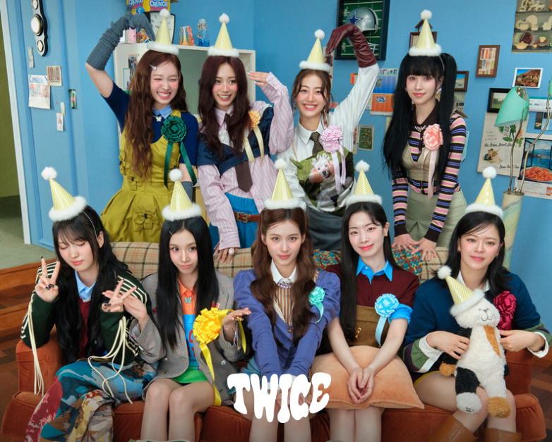

# 莊芸禎

## 關於我

哈囉，我是莊芸禎，目前正在學習程式設計與資訊相關技術。

### 我的技能

* Python 程式設計
* HTML / CSS
* Git 與 GitHub
* Markdown 文件撰寫

mo mo mo mo motto

*我的座右銘：one in a million*

### 我最喜歡的網站

[TWICE](https://app.fans/community/twice/artist)



### 我喜歡的一句話

> 我帶你去看演唱會

### 教育背景

| 學校      | 科系    |
| ------- | ----- |
| 三民家商   | 資處科   |
| 國立高雄科技大學 | 資管系 |

### Python 程式碼

```python
print("Hello, Markdown!")

animal = "貓"
print("你好，我喜歡", animal)
```

### 多行引言區塊

> 程式碼之所以有價值，
> 是因為它能被閱讀、理解和修改。
> 版本控制使這一切成為可能。

### 專案任務表格

| 任務名稱  |  狀態 | 負責人 |       截止日期 |
| ----- | :-: | :-: | ---------: |
| 需求分析  |  完成 |  小明 | 2023-01-15 |
| 資料庫設計 | 進行中 |  小華 | 2023-01-30 |
| 前端介面  | 未開始 |  小李 | 2023-02-15 |
